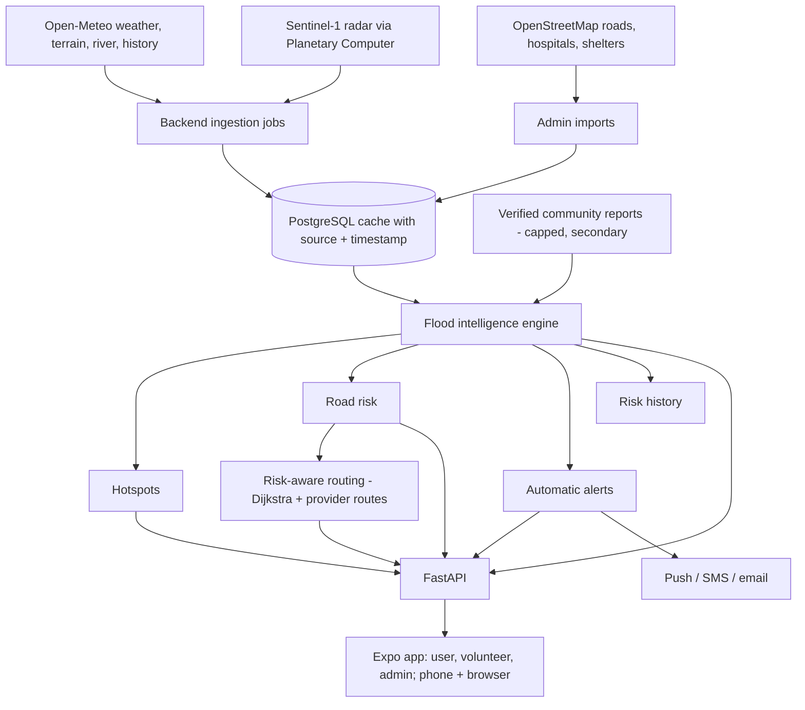

# RiskN ResQ

Hyper-local flood early warning and community response. A FastAPI + PostgreSQL backend and a React Native (Expo) app that runs on phones and in the browser.

> **Status of claims:** the flood-risk model is a **prototype rule-based estimate**, not a validated prediction. Read [docs/CLAIMS_AND_LIMITS.md](docs/CLAIMS_AND_LIMITS.md) for exactly what is real, what is a prototype, what is simulated and what has not been tested on hardware.

## 1. Problem
During urban floods people learn about danger late (a road is already under water), warnings are city-wide instead of street-level, and help (medicine, water, evacuation) is arranged ad hoc. Official warnings rarely say *which roads* are affected or *who nearby can help*.

## 2. Solution
RiskN ResQ combines **environmental evidence first** (rainfall, satellite water change, terrain, river level, rainfall history) with **community reports as secondary evidence**, explains every risk estimate, flags potentially affected roads, recommends routes around blocked and high-risk roads, and matches help requests to nearby volunteers.

## 3. Architecture

**Phones never call weather or satellite services.** The backend fetches on a schedule, stores results, and the app reads processed results (`GET /intelligence/overview`). More detail: [docs/ARCHITECTURE.md](docs/ARCHITECTURE.md), [docs/FLOOD_INTELLIGENCE.md](docs/FLOOD_INTELLIGENCE.md).

## 4. Technology
Backend: Python 3.12+, FastAPI, Pydantic v2, PostgreSQL 16 (psycopg 3; SQLite for quick demos/tests), httpx. App: React Native 0.86 + Expo SDK 57, react-native-web, `react-native-maps` on phones, Leaflet + OpenStreetMap in the browser, expo-location / image-picker / notifications / secure-store. Tests: pytest, Jest (ts-jest), Playwright. Optional: Cloudinary, Twilio, SMTP, Sentry.

## 5. Data sources (all free, no API key)
| Signal | Source |
|---|---|
| Rainfall 1/3/6/24 h + 6 h forecast | Open-Meteo forecast API, polled by the backend every 15 min for a 25-point grid |
| Satellite water change | Sentinel-1 radar (Microsoft Planetary Computer STAC + statistics API); Sentinel-2 NDWI as optical fallback |
| Terrain | Copernicus DEM 90 m via Open-Meteo (elevation, slope, depression) |
| River level | GloFAS **modelled** river discharge via Open-Meteo Flood API (no gauges are connected) |
| Rainfall history | ERA5 reanalysis, 10 years of daily rain, via Open-Meteo archive |
| Roads, hospitals, shelters | OpenStreetMap (Overpass), imported by an admin |
| Routing | OSRM (free) or Google Routes if `GOOGLE_ROUTES_API_KEY` is set |

## 6. Real vs simulated data
Normal operation uses real data only (accounts, reports, photos, requests, matches, road status, provider observations). Simulation exists only as an explicit admin drill: its rainfall is stored on the zone, labelled **SIMULATED DRILL** everywhere, never overwrites a real observation, never sends notifications, and *Reset* removes it. Offline data is labelled **SAVED DATA (OFFLINE)**, old provider data **STALE DATA**, missing data "... unavailable". See [docs/CLAIMS_AND_LIMITS.md](docs/CLAIMS_AND_LIMITS.md).

## 7. Flood intelligence in one paragraph
Per ~9 km grid cell the engine adds: rainfall (worst of 24 h, 1.5x 6 h, 4x 1 h) + forecast + abnormal satellite water gain (vs the median of three earlier passes on the same orbit; lakes and rivers are in the baseline so are never flagged) + terrain susceptibility (only while it rains) + river level + rainfall-history context + a **capped** community-report term (reports alone can never exceed MEDIUM). Missing signals are listed and contribute nothing; with no usable weather the answer is "Insufficient data to estimate current flood risk." A potential **hotspot** needs HIGH risk and two independent signal families. Weights are documented and **not scientifically validated**; the probability is an uncalibrated mapping; the ML layer reports "not trained" until enough real labelled history exists. Full formulas and limits: [docs/FLOOD_INTELLIGENCE.md](docs/FLOOD_INTELLIGENCE.md).

## 8. Routing
Candidate routes come from the real street network. Routes crossing a blocked road or a blocking incident are excluded (routes are densified so a long straight segment cannot slip past a closed road); the rest are ranked by `time x (1 + 0.6 x mean flood risk/100) x (1 + 0.1 per potentially-affected road)`. The geospatial module's Dijkstra uses the same risk-weighted cost when roads carry a risk score. Road states: `OPEN`, `POTENTIALLY_AFFECTED` (area-level estimate), `REPORTED_BLOCKED`, `VERIFIED_BLOCKED` (admin closure or verified incident). Wording is always "Recommended alternative route based on current environmental and incident data": never "safe".

## 9. Volunteer matching
A help request (medicine, food, water, first aid, evacuation; with priority and quantity) is matched to the nearest available volunteer whose skill/resources fit, using the original distance-based matcher. Volunteers can also claim open requests. Status timeline and live ETA are shown to the requester; volunteers declare resource quantities that decrease on completion. Admins see demand, capacity and *suggested* standby positions (never an automatic dispatch).

## 10. Roles
| Role | Can |
|---|---|
| User (self-registers) | Home, map layers, report incidents with photos, request help, alerts, evacuation lookup, account, language (EN/HI/KN) |
| Volunteer (created by admin) | Availability, location, requests, nearby requests, accept/complete, route and ETA |
| Super Admin (from `.env`) | Everything above plus people, incident review, drill, road control, broadcast, intelligence, insights, CSV export, audit log, OSM imports, reset |

Server-side checks on every endpoint; passwords scrypt-hashed; tokens and reset codes stored hashed; login lockout; per-IP rate limits; audit log of admin actions.

## 11. Setup
Prerequisites: Python 3.12+, Node 20+, PostgreSQL 16 (optional but recommended).

### PostgreSQL
```bash
createdb risknresq                       # PostgreSQL must be running (macOS: brew services start postgresql@16)
# backend/.env:  DATABASE_URL=postgresql://<user>:<password>@localhost:5432/risknresq   (Homebrew: your login name, no password)
```
Tables, indexes and column upgrades are created automatically at start. Without `DATABASE_URL` a local SQLite file is used. Optional `DB_SCHEMA=name` runs inside an isolated PostgreSQL schema (staging, end-to-end tests).

### Environment variables
Names only (copy `backend/.env.example` to `backend/.env`; it is git-ignored):
`DATABASE_URL`, `ADMIN_EMAIL`, `ADMIN_PASSWORD`, `ADMIN_NAME`, `CORS_ORIGINS`, `TRUST_PROXY`, `APP_URL`, `GOOGLE_ROUTES_API_KEY`, `IMD_API_KEY`, `KSNDMC_API_KEY`, `CLOUDINARY_CLOUD_NAME`, `CLOUDINARY_API_KEY`, `CLOUDINARY_API_SECRET`, `SMTP_HOST/PORT/USER/PASSWORD/FROM`, `TWILIO_ACCOUNT_SID/AUTH_TOKEN/FROM`, `SENTRY_DSN`, `PUSH_ENABLED`, rate limits (`RATE_LIMIT_PER_MINUTE`, `AUTH_RATE_LIMIT_PER_MINUTE`), weather/intelligence tuning (`MONITORING_BOUNDS`, `GRID_SPACING`, `WEATHER_REFRESH_INTERVAL`, `HEAVY_RAIN_THRESHOLD`, `SATELLITE_*`, `SAR_WATER_THRESHOLD_DB`, `INTEL_ENABLED`, ...), `DEMO_DATA`. Only `ADMIN_*` and `DATABASE_URL` are needed to start. Mobile: `EXPO_PUBLIC_API_URL` (**required** for release builds), `GOOGLE_MAPS_API_KEY` (standalone native builds only).

## 12. Run
```bash
# backend (creates the Super Admin from ADMIN_EMAIL / ADMIN_PASSWORD on first start)
cd backend && pip install -r requirements.txt
python -m uvicorn main:app --host 0.0.0.0 --port 8000
python scripts/refresh_intelligence.py        # optional: run every data job once now and print provider status

# app (browser)               # phone (Expo Go): same machine and Wi-Fi, the app finds the backend automatically
cd mobile && npm install
npx expo start --web --port 8082     # or: npx expo start
```
Optional: `scripts/clean_test_data.py` (reset runtime data), `scripts/integrity_check.py` (orphaned references), `scripts/backup_db.sh` (pg_dump), `python scripts/remove_demo_data.py`.

## 13. Tests
```bash
cd backend && python -m pytest -q                                              # SQLite
cd backend && RISKNRESQ_TEST_BACKEND=postgres python -m pytest -q              # PostgreSQL (temporary schema per test; needs DATABASE_URL)
cd mobile  && npx tsc --noEmit && npx jest --runInBand && npx expo-doctor
cd mobile  && npx expo export --platform ios --output-dir /tmp/x && npx expo export --platform android --output-dir /tmp/y
# browser end-to-end (isolated backend: own schema/database file and test admin; real providers)
cd backend && scripts/e2e_backend.sh start && scripts/e2e_backend.sh bootstrap
cd mobile  && npx playwright install chromium && npx playwright test
cd backend && python scripts/persistence_check.py                              # records survive backend restarts; reset keeps accounts
```
CI (`.github/workflows/ci.yml`) runs the backend suite on SQLite and PostgreSQL, the mobile checks and the browser E2E.

## Device testing
`docs/DEVICE_TEST_CHECKLIST.md` is the step-by-step procedure for a real iPhone/Android, and **Account > Device & connection check** inside the app reports server reachability, GPS, camera, notifications and secure storage as measured on the phone.

## 14. Deployment
See [docs/DEPLOYMENT.md](docs/DEPLOYMENT.md): Render blueprint (`render.yaml`: Docker web service + managed PostgreSQL), HTTPS, `TRUST_PROXY`, `CORS_ORIGINS`, EAS Android builds with `EXPO_PUBLIC_API_URL`, push notifications, backups.

## 15. Demo flow (5-10 minutes)
See [docs/DEMO_SCRIPT.md](docs/DEMO_SCRIPT.md). Short version: Home (real weather, explained risk) -> Map (layers, satellite change, evacuation route) -> Admin *Guided demo* (SIMULATED DRILL) -> alert -> road blocked -> alternative route -> help request -> volunteer accepts -> admin history, Insights, CSV, audit log.

## 16. Known limitations
Prototype risk weights; ~9 km risk cells; Sentinel-1 passes every 6-12 days; no river gauges or official flood ground truth connected; ML untrained; sparse OpenStreetMap shelters; Open-Meteo free-tier daily limit; admin/volunteer screens English only; **nothing has been verified on a physical phone** (native maps, camera, GPS, push, Cloudinary, SMS/email delivery). Details in [docs/CLAIMS_AND_LIMITS.md](docs/CLAIMS_AND_LIMITS.md).

## Project layout
`backend/`: `main.py` (core API), `routes_account.py`, `routes_admin.py`, `routes_intel.py`, `engine.py` (risk, trust, alerts), `flood_intel.py`, `intel_jobs.py`, `weather_monitor.py`, `road_risk.py`, `routing_service.py`, `ml_model.py`, `notify.py`, `auth.py`, `db.py`, `providers/` (weather, satellite, terrain, waterlevel, climate, routing), `scripts/`, `tests/`. `mobile/`: `src/screens` (user, `volunteer/`, `admin/`, `auth/`), `src/components`, `src/context`, `src/services`, `src/i18n`, `src/features/disaster-response` (geospatial module: geofencing, Dijkstra, matching), `e2e/` (Playwright), `__tests__/`. `docs/`: architecture, flood intelligence, claims and limits, deployment, demo script, screenshots.
