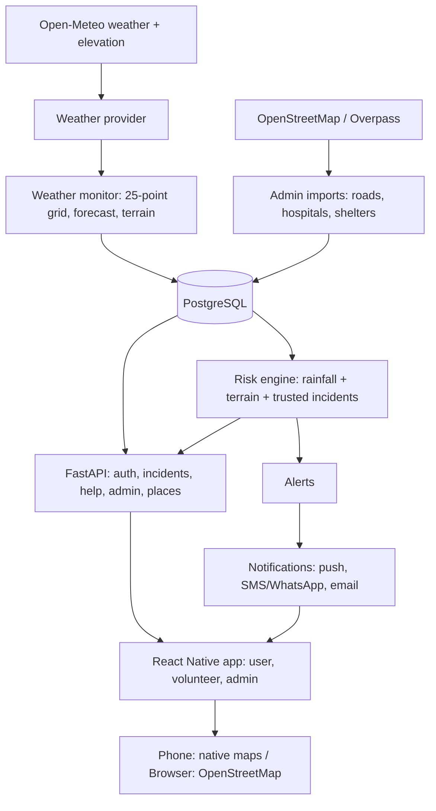

# Architecture

**Flood intelligence:** weather, Sentinel-1 satellite water change, terrain, modelled river discharge and rainfall history feed the
risk engine; see [FLOOD_INTELLIGENCE.md](FLOOD_INTELLIGENCE.md).

**Request path:** the app only talks to the FastAPI backend. The backend polls weather every 15 minutes and every client reads
the cached result, so ten phones never mean ten weather calls.

**Trust model:** three roles, server-side checks on every endpoint; tokens and reset codes are stored hashed; admin actions
are written to an append-only audit log.

**Honesty rules built in:** heavy rainfall is shown as rainfall, never as a flood; simulated drills are labelled and never
notify anyone; if the backend or weather provider is down the app says so and shows only clearly labelled saved data.
